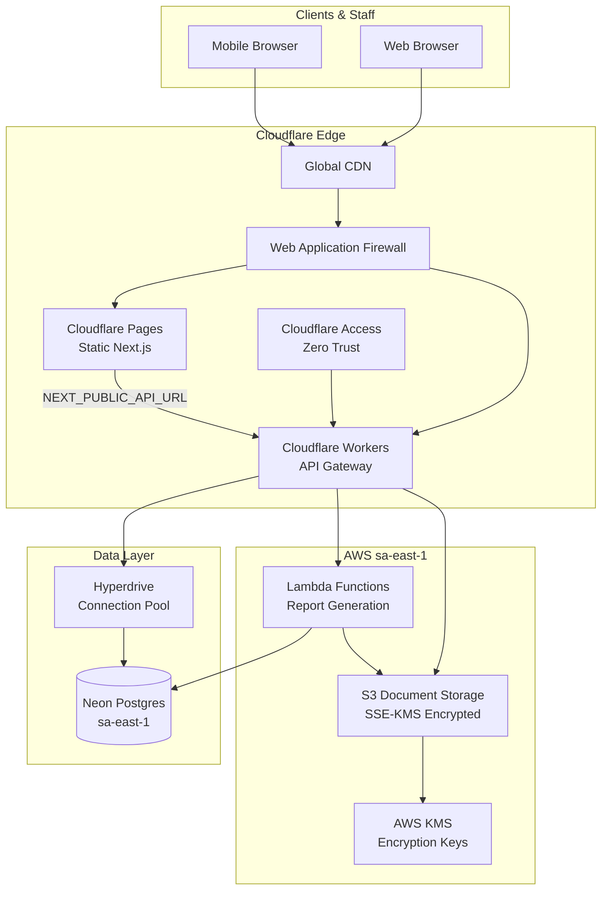
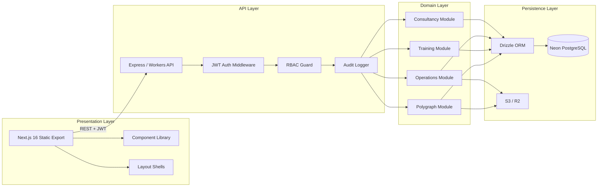
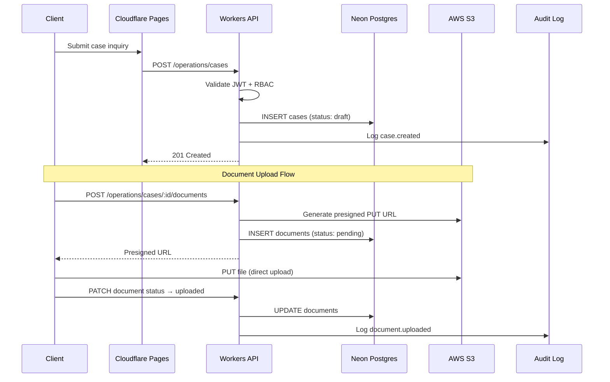
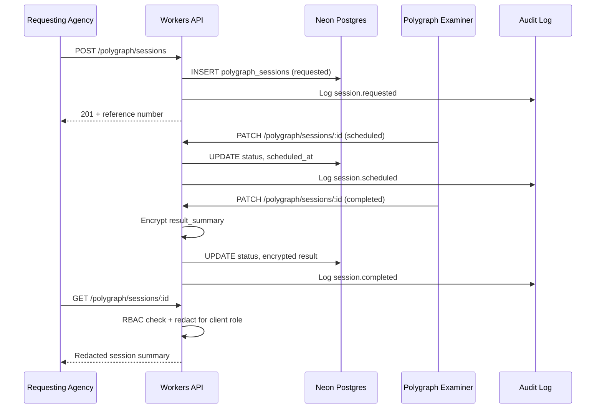
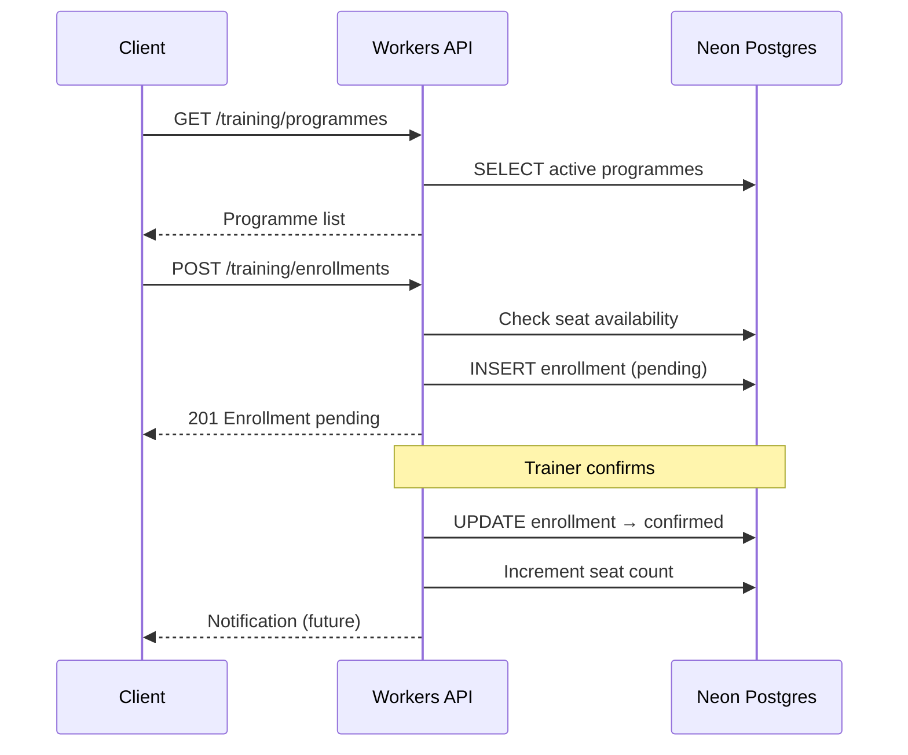
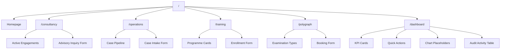
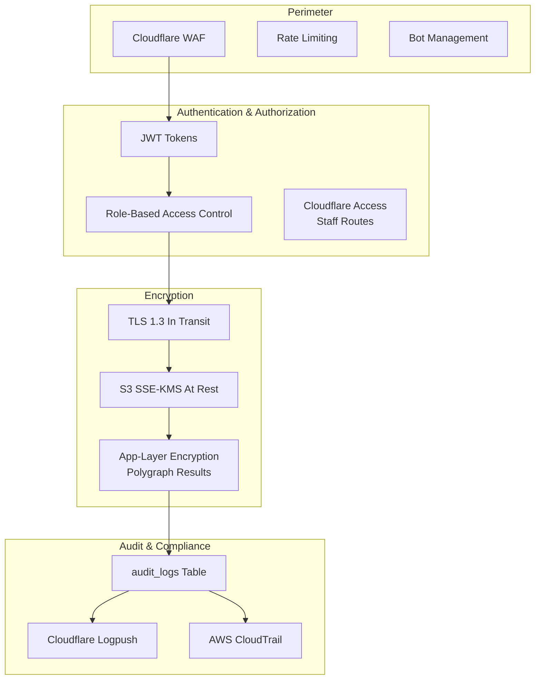

# LEAF-C Architecture Overview

System architecture for the LEAF-C multidisciplinary investigative and compliance agency platform.

## High-Level System Architecture



## Application Layers



## Data Flow — Case Investigation Lifecycle



## Data Flow — Polygraph Session



## Data Flow — Training Enrollment



## Frontend Route Map



## Security Architecture



## Technology Stack

| Layer | Technology | Version |
|-------|-----------|---------|
| Frontend framework | Next.js (App Router, static export) | 16.x |
| Styling | Tailwind CSS | v4 |
| UI fonts | Montserrat + Inter | Google Fonts |
| Backend runtime | Express → Cloudflare Workers | 5.x |
| ORM | Drizzle ORM | 0.45.x |
| Database | Neon PostgreSQL | sa-east-1 |
| Document storage | AWS S3 | SSE-KMS |
| CDN / Edge | Cloudflare Pages + Workers | — |
| CI/CD | GitHub Actions | — |

## Monorepo Structure

```
Leafc/
├── frontend/           # Next.js static export
│   ├── app/            # App Router pages
│   ├── components/
│   │   ├── ui/         # Design system components
│   │   └── layout/     # Header, footer, dashboard shell
│   └── lib/            # Utilities
├── backend/            # Express API (→ Workers migration)
│   └── src/
│       ├── db/         # Drizzle schema + connection
│       └── routes/     # REST route handlers
├── docs/
│   ├── design/         # Design system documentation
│   ├── api/            # Schema + endpoint specs
│   ├── deployment/     # Infrastructure plan
│   └── architecture/   # This document
└── leafc_logo/         # Brand assets
```
